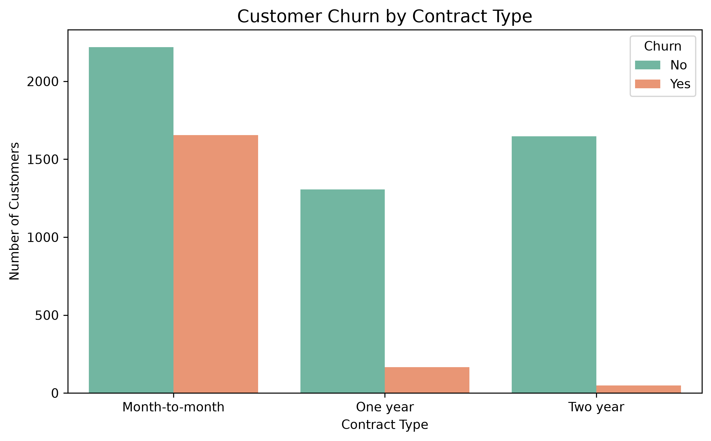
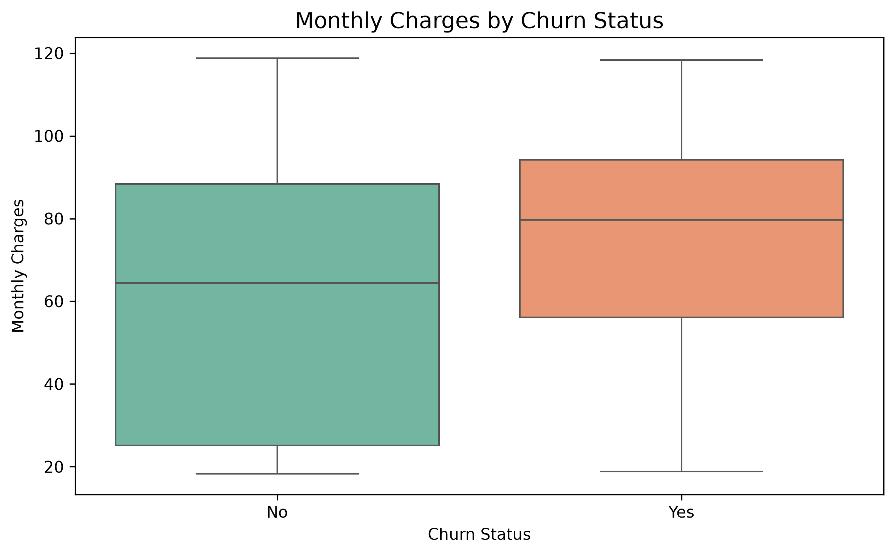
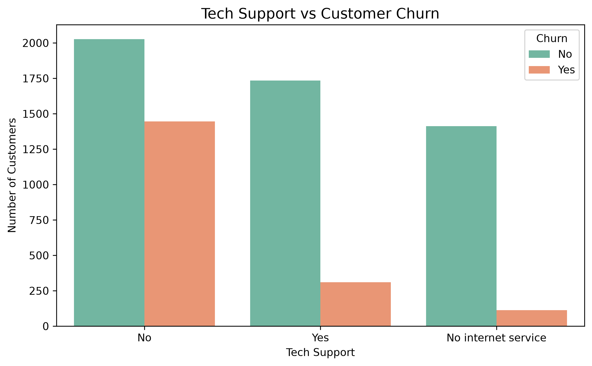
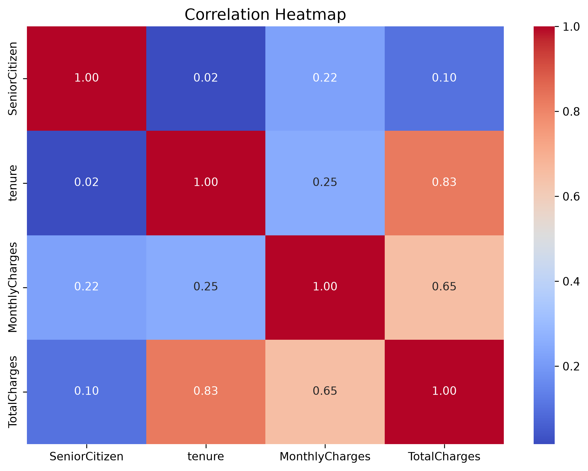

# Customer Churn Analytics

A Data Analytics project that analyzes customer churn using Python, SQL, and Power BI. The objective is to identify the key factors influencing customer churn and provide actionable business insights to improve customer retention.

---

## Project Overview

Customer churn is one of the biggest challenges faced by subscription-based businesses. This project performs end-to-end data analysis on a telecom customer dataset to identify churn patterns through data cleaning, exploratory data analysis (EDA), visualization, and business insights.

---

## Tech Stack

- Python
- Pandas
- NumPy
- Matplotlib
- Seaborn
- SQL (MySQL)
- Power BI
- Git & GitHub

---

## Project Structure

```
Churn-Analytics/
│
├── dataset/
├── images/
├── python/
│   ├── 01_data_loading.py
│   ├── 02_data_cleaning.py
│   ├── 03_eda.py
│   ├── 04_visualization.py
│   └── 05_business_insights.py
│
├── sql/
├── powerbi/
├── reports/
├── requirements.txt
└── README.md
```

---

## Key Business Insights

- Customers with Month-to-Month contracts have the highest churn rate.
- Customers without Tech Support are more likely to churn.
- Customers without Online Security churn significantly more.
- Customers with shorter tenure have a higher probability of leaving.
- Customers with higher Monthly Charges are more likely to churn.
- Electronic Check users show higher churn compared to other payment methods.
- Customers without Dependents churn almost twice as much as customers with Dependents.
- Long-term contract customers (One Year and Two Year) are more loyal.

---

##  Visualizations

The project includes several business-oriented visualizations, including:

- Customer Churn Distribution
- Contract vs Churn
- Monthly Charges vs Churn
- Tech Support vs Churn
- Correlation Heatmap

---

## Sample Visualizations

### Contract vs Churn



### Monthly Charges vs Churn



### Tech Support vs Churn



### Correlation Heatmap



---

## Power BI Dashboard

The project also includes an interactive Power BI dashboard featuring:

- KPI Cards
- Churn Rate
- Customer Segmentation
- Contract Analysis
- Internet Service Analysis
- Payment Method Analysis
- Interactive Filters

*(Add a dashboard screenshot after completing the dashboard.)*

---

##  How to Run

Clone the repository:

```bash
git clone <your-repository-url>
```

Create a virtual environment:

```bash
python -m venv .venv
```

Activate it:

```bash
.\.venv\Scripts\activate
```

Install dependencies:

```bash
pip install -r requirements.txt
```

Run any Python script:

```bash
python python/03_eda.py
```

---

##  Future Improvements

- Build a machine learning model to predict customer churn.
- Deploy the project using Streamlit.
- Connect the dashboard to a live database.
- Automate report generation.

---

##  Author

**Tanay Chaturvedi**

GitHub: https://github.com/Tanay-chaturvedi/Churn-Analytics